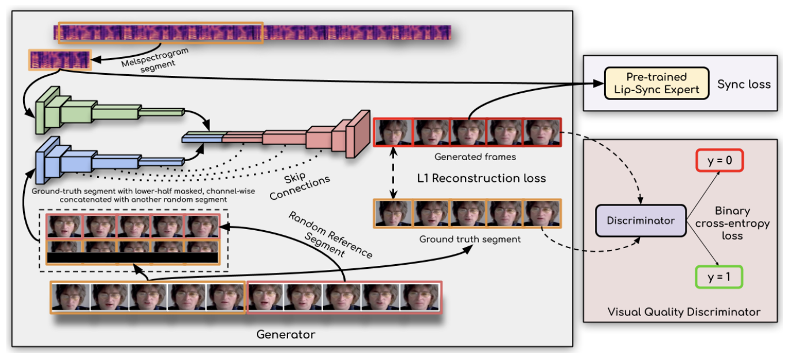
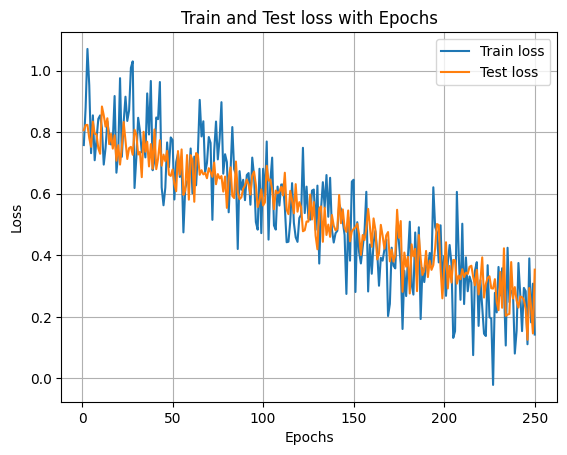
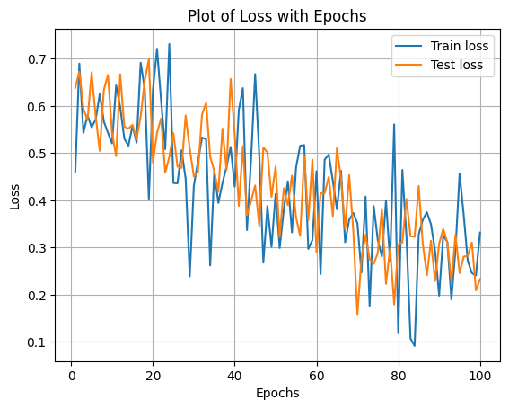

# **Lip Syncing Module**

This code is inspired by the work of [A Lip Sync Expert Is All You Need for Speech to Lip Generation In the Wild](http://arxiv.org/abs/2008.10010)

The key to this module's success is that it learns from a powerful "lip-sync discriminator" that can tell how good a lip sync is. This discriminator helps the generator model avoid the mistakes of previous methods, which had trouble with lip syncing on unseen people or moving videos.

The architecture of this module is as follows [Prajwal et al., 2020](http://arxiv.org/abs/2008.10010)



## Prerequisites
Install necessary packages using `pip install -r requirements.txt`.

## Lip-syncing videos using the pre-trained models (Inference)

```bash
python inference.py --checkpoint_path <ckpt> --face <video.mp4> --audio <an-audio-source> 
```
The result is saved (by default) in `../result.mp4`. You can specify it as an argument,  similar to several other available options. The audio source can be any file supported by `FFMPEG` containing audio data: `*.wav`, `*.mp3` or even a video file, from which the code will automatically extract the audio.

## Training

There are two major steps: (i) Train the expert lip-sync discriminator, (ii) Train the Wav2Lip model(s).

##### Training the expert discriminator
You can download [the pre-trained weights](https://drive.google.com/drive/folders/1uN6hci10QlIZb7pg1D5MVaMY6Dgrnsp5?usp=share_link) if you want to skip this step.
Else you can run
```bash
python color_syncnet_train_plots.ipynb
```
Upon training we received the following graph



##### Training the Wav2Lip models
You can either train the model without the additional visual quality disriminator (< 1 day of training) or use the discriminator (~2 days). For the former, run: 
```bash
python wav2lip_train_plots.ipynb
```
Upon training we received the following graph


