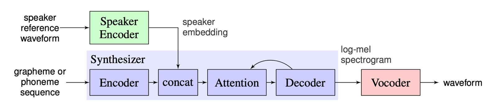
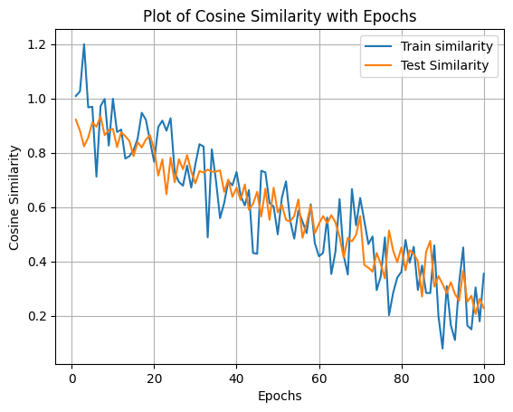

# Voice Cloning Module
We have created code for this voice cloning module based on the paper [Transfer Learning from Speaker Verification to
Multispeaker Text-To-Speech Synthesis](https://arxiv.org/pdf/1806.04558.pdf) (SV2TTS).

The deep learning framework proposed in the paper consists of three stages. In the first stage, one creates a digital representation of a voice from a few seconds of audio. In the second and third stages, this representation is used as reference to generate speech given arbitrary text.

The model architecture for this voice cloning module is as follows (based on the work done by Jia et. al, 2019)

## Setup

### 1. Install Requirements
- Both Windows and Linux are supported. A GPU is recommended for training and for inference speed, but is not mandatory.
- Python 3.7 is recommended. Python 3.5 or greater should work, but you'll probably have to tweak the dependencies' versions. I recommend setting up a virtual environment using `venv`, but this is optional.
- Install [ffmpeg](https://ffmpeg.org/download.html#get-packages). This is necessary for reading audio files.
- Install [PyTorch](https://pytorch.org/get-started/locally/). Pick the latest stable version, your operating system, your package manager (pip by default) and finally pick any of the proposed CUDA versions if you have a GPU, otherwise pick CPU. Run the given command.
- Install the remaining requirements with `pip install -r requirements.txt`

### 2. Training Models (Optional)

Pretrained models are automatically downloaded in the primary inference file on this GitHub repository but it can also be downloaded [here](https://drive.google.com/drive/folders/1gepTaAwryRh7FjCKuIF3hCT0WpH7f1_z?usp=sharing).

#### i) Encoder
You can run encoder_train.py with the following parameters
- run_id (required): This is a string argument that the user must provide. It specifies a name for the current training run. This name is used for several purposes:
    - Identifies the training run for logging and organization.
    - Determines the directory where training outputs are stored (e.g., saved models).
    - Allows resuming training from a previously saved state with the same run_id (unless --force_restart is used).
- clean_data_root (required): This argument (type Path) specifies the directory containing preprocessed data for training the encoder part of the model.
- models_dir (optional): This argument (type Path) allows specifying the root directory for storing all trained models. By default, it's set to "saved_models". A subdirectory named after run_id will be created within this directory to store the specific model weights, backups, and plots generated during training.
vis_every (optional): This argument (type int) controls how often (number of steps) the training script updates and displays plots related to the loss function. The default value is 10 steps.
- umap_every (optional): This argument (type int) controls how often (number of steps) the script updates a dimensionality reduction technique called UMAP to visualize the data. Setting it to 0 disables UMAP updates. The default value is 100 steps.
- save_every (optional): This argument (type int) controls how often (number of steps) the script saves the current model state. Setting it to 0 disables saving the model during training. The default value is 500 steps.
- backup_every (optional): This argument (type int) controls how often (number of steps) the script creates backups of the saved model state. Setting it to 0 disables backups. The default value is 7500 steps.
- force_restart (optional): This argument is a flag (type bool). When set to True, it instructs the script to not load any previously saved model state and start training from scratch, even if a model with the same run_id exists.
- visdom_server (optional): This argument (type str) allows specifying the address of a visualization server (likely Visdom) used for plotting training progress. The default value is "http://localhost".
- no_visdom (optional): This argument is a flag (type bool). When set to True, it disables using Visdom for visualization altogether.

Our training for 100 epochs gave us the following result

#### ii) Vocoder
You can run vocoder_train.py with the following parameters
- run_id (required): This is a string argument that the user must provide. It specifies a name for the current training run. This name is used for several purposes, similar to the previous snippet:
    - Identifies the training run for logging and organization.
    - Determines the directory where training outputs are stored (e.g., saved models).
    - Allows resuming training from a previously saved state with the same run_id (unless --force_restart is used).
- datasets_root (required): This argument (type Path) specifies the main directory containing the overall dataset for training. This directory should contain a subdirectory named "SV2TTS".
- syn_dir (optional): This argument (type Path) allows specifying the path to a subdirectory named "synthesizer" within the SV2TTS directory. This directory is expected to contain ground truth data for training, such as mel spectrograms, audio waveforms, and embeddings. If not provided, it defaults to <datasets_root>/SV2TTS/synthesizer/.
- voc_dir (optional): This argument (type Path) allows specifying the path to a subdirectory named "vocoder" within the SV2TTS directory. This directory is expected to contain preprocessed mel spectrograms for training, likely generated by a separate vocoder model. If not provided and --ground_truth is not used, it defaults to <datasets_root>/SV2TTS/vocoder/.
- m (same as previous snippet): This argument (type Path) allows specifying the root directory for storing all trained models. By default, it's set to "saved_models". A subdirectory named after run_id will be created within this directory to store the specific model weights, backups, and generated audio samples during training.
- g (ground_truth): This argument is a flag (type bool). When set to True, it instructs the script to train on ground truth mel spectrograms located in <datasets_root>/SV2TTS/synthesizer/mels. This takes priority over using preprocessed data from --voc_dir.
- s (same as previous snippet): This argument (type int) controls how often (number of steps) the script saves the current model state. Setting it to 0 disables saving the model during training. The default value is 1000 steps.
- b (same as previous snippet): This argument (type int) controls how often (number of steps) the script creates backups of the saved model state. Setting it to 0 disables backups. The default value is 25000 steps.
- f (same as previous snippet): This argument is a flag (type bool). When set to True, it instructs the script to not load any previously saved model state and start training from scratch, even if a model with the same run_id exists.

#### iii) Synthesizer
You can run synthesizer_train.py with the following parameters
- run_id (required): This argument (type str) is the same as before. It specifies a name for the current training run, used for organization, output storage, and potentially resuming training.
- syn_dir (required): This argument (type Path) differs from the previous snippets. Here, it's a required argument that specifies the path to the synthesizer directory. This directory is expected to contain the ground truth data for training, such as mel spectrograms, audio waveforms (wavs), and embeddings.
- m (same as previous snippet): This argument (type Path) allows specifying the root directory for storing all trained models. By default, it's set to "saved_models". A subdirectory named after run_id will be created within this directory to store the specific model weights and logs.
- s (same as previous snippet): This argument (type int) controls how often (number of steps) the script saves the current model state. Setting it to 0 disables saving the model during training. The default value is 1000 steps.
- b (same as previous snippet): This argument (type int) controls how often (number of steps) the script creates backups of the saved model state. Setting it to 0 disables backups. The default value is 25000 steps.
- f (same as previous snippet): This argument is a flag (type bool). When set to True, it instructs the script to not load any previously saved model state and start training from scratch, even if a model with the same run_id exists.
- hparams (optional): This argument (type str) allows specifying hyperparameter overrides for the training process. Hyperparameters are settings that control the training behavior but are not part of the model itself. This argument takes a comma-separated list of "name=value" pairs, allowing you to adjust specific hyperparameters without modifying the main training script. The default value is an empty string, meaning no overrides are applied.

### 3. Running Inference
Inferencing can be done by running demo_cli.py and passing the following parameters
- e, --enc_model_fpath (optional): This argument (type Path) specifies the path to a pre-trained encoder model file (default: /content/DL-Final-Project/VoiceCloning/saved_models/default/encoder.pt). The encoder is likely part of a larger model used for processing text.
- s, --syn_model_fpath (optional): This argument (type Path) specifies the path to a pre-trained synthesizer model file (default: /content/DL-Final-Project/VoiceCloning/saved_models/default/synthesizer.pt). The synthesizer likely generates audio (speech) based on the encoded text.
- v, --voc_model_fpath (optional): This argument (type Path) specifies the path to a pre-trained vocoder model file (default: /content/DL-Final-Project/VoiceCloning/saved_models/default/vocoder.pt). The vocoder might further process the synthesizer's output to improve the audio quality.
- cpu (optional): This argument is a flag (type bool). When set to True, it forces the script to use the CPU for processing, even if a GPU is available.
- no_sound (optional): This argument is a flag (type bool). When set to True, it prevents the script from playing the generated audio after processing.
- seed (optional): This argument (type int) allows specifying an optional random seed value. Setting a seed makes the script's behavior deterministic (same results for the same inputs), which can be helpful for debugging or reproducibility.
- text (optional): This argument (type str) provides the text to be processed by the models. By default, it's set to "This is a deep learning sample".
